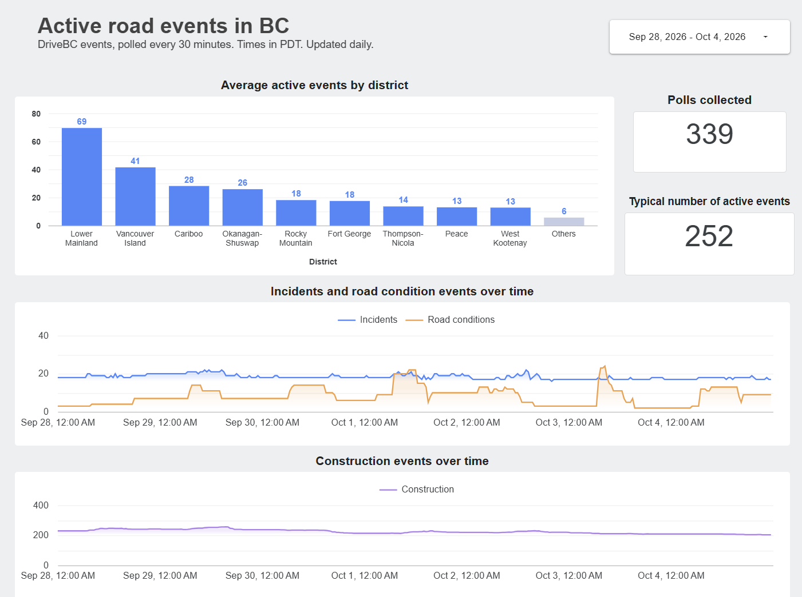
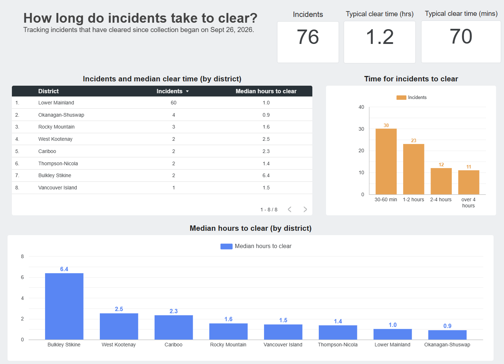

# drivebc-pipeline

A data pipeline that collects road event data from the [DriveBC Open511 API](https://api.open511.gov.bc.ca/help)
every 30 minutes and models it into a BigQuery warehouse with dbt, so questions
about British Columbia's road network can be answered over time.

## Dashboard

Built in Data Studio on the `dbt_prod` marts. Screenshots taken 2026-10-05.

More pages will be added as enough history accumulates to answer the remaining [questions](#questions-it-answers).





## Architecture

```
DriveBC Open511 API
        │
        │  Cloud Scheduler, every 30 min
        ▼
Cloud Run job: collector (Python)
        │  full pull, paginated, retries on 429
        ▼
BigQuery  bronze.raw_events   one row per poll, response stored as raw JSON
          bronze.poll_log     one row per poll attempt, success or failure
        │
        │  Cloud Scheduler, daily at 10:00 UTC
        ▼
Cloud Run job: dbt build
        │
        ▼
BigQuery  dbt_prod.stg_drivebc__events            one row per (event, poll)
          dbt_prod.fct_active_events_by_district  one row per (poll, district)
          dbt_prod.fct_event_lifecycle            one row per event
```

Collection and transformation run on **separate schedules**: polling needs to be
frequent enough to catch short-lived incidents, while transforming more than once
a day would add cost without adding information.

Both Cloud Run jobs run as a service account with only `bigquery.jobUser` and
`bigquery.dataEditor` on the project, plus `run.invoker` on the two jobs
themselves so Cloud Scheduler can start them. Credentials are resolved from the
attached identity at runtime, so no key material exists in the repository or in
CI.

## Questions it answers

**Now**

- How many events are active in each district at any moment, split by type?
- How long does an incident take to clear? Median **70 minutes** across 76
  incidents (as of 2026-10-05). Quoted overall only: 60 of the 76 are in the
  Lower Mainland, and most other districts have one to four.

**Once more history accumulates**

- Median time to clear an incident, by highway or district
- How long roads stay fully closed
- Which road segments see repeat events
- When incidents *start*, by hour of day and day of week

## Data model

| Layer   | Table                           | One row is                            | Materialized                     |
| ------- | ------------------------------- | ------------------------------------- | -------------------------------- |
| bronze  | `raw_events`                    | one poll, response unmodified as JSON | table (written by the collector) |
| bronze  | `poll_log`                      | one poll attempt                      | table (written by the collector) |
| staging | `stg_drivebc__events`           | one event, as seen in one poll        | table                            |
| mart    | `fct_active_events_by_district` | one district, at one poll             | table                            |
| mart    | `fct_event_lifecycle`           | one event                             | table                            |

Bronze is append-only and never modified, so any downstream model can be changed
and rebuilt from the original responses.

`fct_active_events_by_district` holds one count column per DriveBC event type
(construction, special event, incident, weather condition, road condition) plus a
total, and `poll_ts` in both UTC and Pacific time. It is built from polls that
actually returned data, so a poll the collector missed is **absent from the
series** rather than appearing as zero events. The series begins when polling
settled at a steady 30-minute cadence; earlier intervals varied and would weight
those days unevenly.

`fct_event_lifecycle` collapses each event's many per-poll observations into one
row. The start time is the API's `created_utc`. The end time has to be inferred,
because DriveBC never marks an event as ended; it simply stops appearing. So
`cleared_at` is the first poll that no longer saw the event, which makes every
duration accurate to within one 30-minute poll interval. Two flags expose what
the data cannot see rather than filtering it out:

- `is_cleared` is false for events still open, which have no duration yet.
- `was_active_at_collection_start` is true for events already running when
  collection began, whose real start predates our first observation.

Duration analysis filters on both; the choice is left to the query, not baked
into the table.

## Decisions and tradeoffs

**The mart trusts payloads, not the log.**
Each poll writes its response to `raw_events`, then records the attempt in
`poll_log`. Because the log row is written second, a collector killed in between
leaves real data with no log row. The mart originally took its list of polls from
`poll_log` and so discarded those two polls' data. It now derives them from
`raw_events`: a payload is evidence a poll ran, while a log row is only a claim
about it. `poll_log` remains the record of failures and of gaps between polls.

**30-minute polling, not 15 or 60.**
Measured against four days of 15-minute data: hourly polling would have missed
16% of incidents entirely, 30-minute polling misses about 6%. Half of all
incidents observed had a lifespan under an hour, which is why the interval matters
at all. 30 minutes halves the storage of 15-minute polling for a small loss in
coverage.

**One raw JSON row per poll, not parsed columns.**
The collector does no interpretation. Every parsing decision lives in dbt, where
it can be corrected and re-run against the history already collected. It is also
what keeps the collector small enough to trust.

**Tables, not views, for dbt models.**
Staging began as a view. Because a view re-runs its query on every read, each of
the tests and the mart paid a full scan of bronze's JSON — about a dozen
full scans per `dbt build`. As a table, bronze is read once per run and everything
downstream reads only the columns it needs.

## Repository layout

```
collector/          the polling script, its Dockerfile and dependencies
transform/          the dbt project, plus the Dockerfile for the scheduled run
infra/              setup SQL for the BigQuery datasets and tables
docs/               dashboard screenshots
```

## Data licence

Road event data is published by the Province of British Columbia under the
[Open Government Licence – British Columbia](https://www2.gov.bc.ca/gov/content/data/open-data/open-government-licence-bc).
No personal data is collected.
